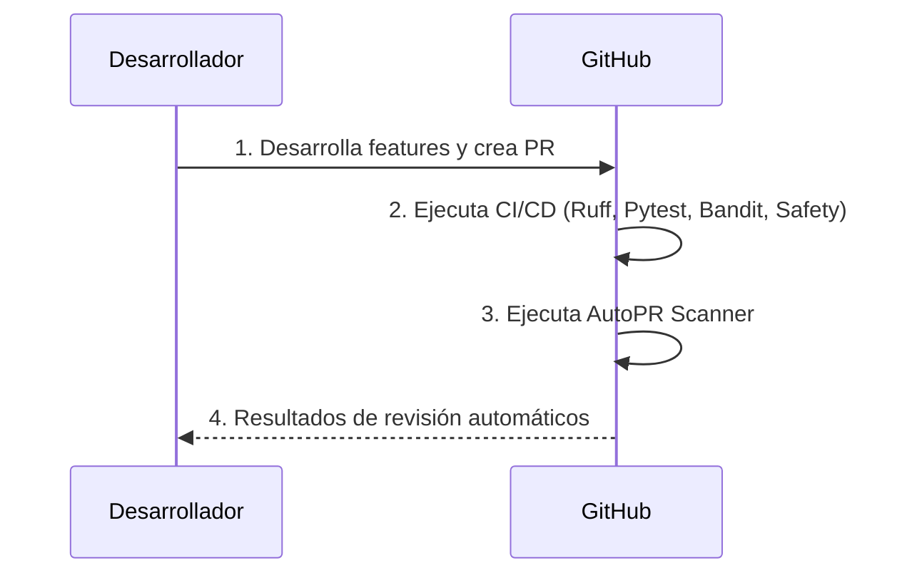

# Arquitectura DevSecOps: AutoPR-Lab

El proyecto AutoPR-Lab está diseñado de forma nativa para GitHub. Utiliza GitHub Actions para automatizar el análisis de Pull Requests y CI/CD, asegurando una integración continua eficiente y segura.

## Flujo de Trabajo (GitHub)

