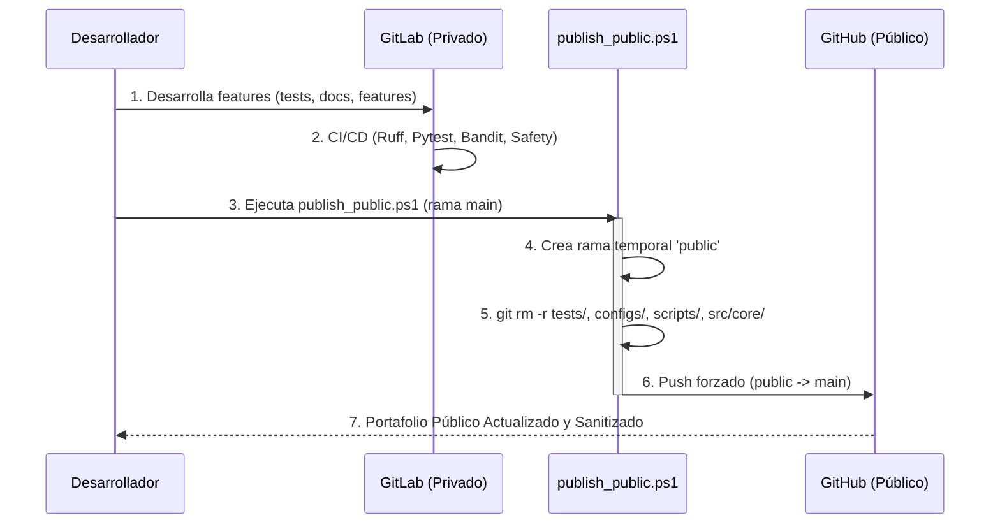

# Arquitectura DevSecOps: AutoPR-Lab

El proyecto AutoPR-Lab utiliza una arquitectura de doble entorno para separar la **Zona de Laboratorio Privado (GitLab)** de la **Zona de Portafolio Público (GitHub)**. Esta estrategia asegura que los tests internos, las configuraciones sensibles y el código núcleo permanezcan completamente privados, mientras que una versión sanitizada se expone públicamente.

## Flujo de Publicación (GitLab → GitHub)

